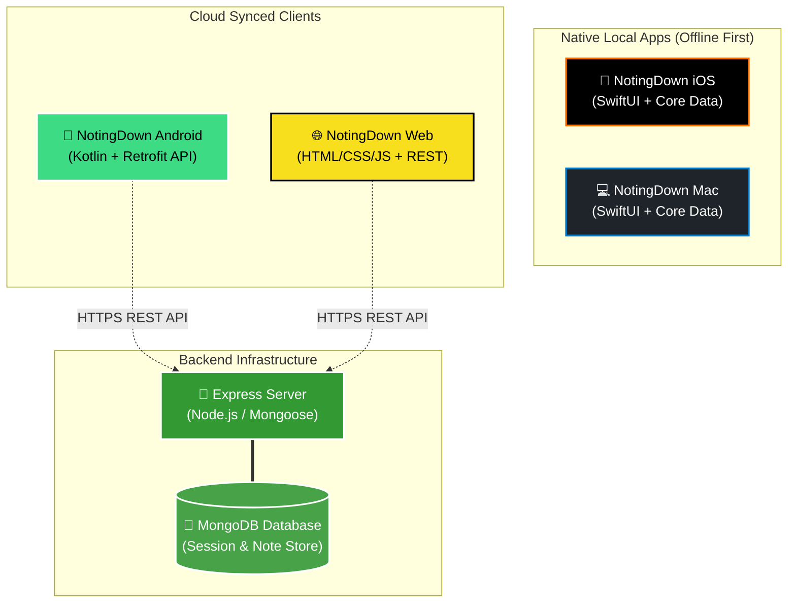

<div align="center">

# 📝 NotingDown Ecosystem

### *A modern, multi-platform, unified note-taking suite optimized for every device.*

[](https://github.com/sachin6174/Noting-Down-All-Platforms)
[](https://github.com/sachin6174/Noting-Down-All-Platforms)
[](https://github.com/sachin6174/Noting-Down-All-Platforms)

---

</div>

## 📱 Ecosystem Overview

**NotingDown** is a unified note-taking ecosystem designed to work seamlessly across multiple operating systems. Whether you need a secure, fully offline app on your Apple device or a cloud-synced experience on your Android phone or browser, NotingDown has a dedicated client tailored to that platform's strengths.

### 🌟 Key Architectures
*   **Offline-First Clients (Apple Suite)**: The **iOS** and **macOS** clients utilize native **SwiftUI** and **Core Data** for high-performance, offline-first storage and smooth transitions.
*   **Connected Clients (Android & Web)**: The **Android** (Kotlin) and **Web** (Vanilla JS) clients interact with the **Node.js Express Server** to provide authenticated cloud syncing backed by a **MongoDB** database.

---

## 🗺️ System Architecture

The ecosystem's architecture details how clients connect either directly to the local system or sync through the central API backend:



---

## 📊 Feature Comparison & Platform Matrix

| Feature | 📱 iOS | 💻 macOS | 🤖 Android | 🌐 Web Client | 🚀 Backend Server |
| :--- | :---: | :---: | :---: | :---: | :---: |
| **Offline Storage** | ✅ (Core Data) | ✅ (Core Data) | ❌ (API Sync) | ❌ (API Sync) | — |
| **User Auth** | ❌ (Local Device) | ❌ (Local Device) | ✅ (Express Session) | ✅ (Express Session) | ✅ (bcrypt/Session) |
| **Voice Notes** | ✅ | ❌ | ❌ | ❌ | — |
| **Haptic Feedback** | ✅ | ❌ | ❌ | ❌ | — |
| **Export/Share** | ✅ | ❌ | ❌ | ❌ | — |
| **Session Cleanup** | — | — | — | — | ✅ (MongoDB TTL Index) |
| **Design Language** | SwiftUI | SwiftUI | Material / XML | Vanilla CSS | REST API |

---

## 📁 Repository Structure

```directory
Noting-Down-All-Platforms/
├── ANotingDownServer/      # Node.js/Express API server, MongoDB connector
├── NotingDownAndroid/      # Kotlin Android client (Android Studio gradle project)
├── NotingDowniOS/          # SwiftUI iOS application for iPhone & iPad
├── NotingDownMac/          # SwiftUI macOS desktop application
├── NotingDownWeb/          # HTML/CSS/JavaScript vanilla web frontend client
├── NotingDownWindows/      # Placeholder for future Windows client
└── NotingDownLinux/        # Placeholder for future Linux client
```

---

## 🚀 Setup & Launch Instructions

### 1. 🚀 Backend Server (`ANotingDownServer`)
The Node.js server handles authentication sessions and CRUD operations for notes.

> [!IMPORTANT]
> Make sure MongoDB is installed and running locally on port `27017` before starting the server.

1. Navigate to the server directory:
   ```bash
   cd ANotingDownServer
   ```
2. Install dependencies:
   ```bash
   npm install
   ```
3. Create a `.env` file in the `ANotingDownServer` directory:
   ```env
   PORT=3001
   MONGODB_URI=mongodb://localhost:27017/notingdown
   SESSION_SECRET=your_super_secret_session_key
   ```
4. Start the server in development mode:
   ```bash
   npm run dev
   ```
   *The server will start running on [http://localhost:3001](http://localhost:3001).*

---

### 2. 🌐 Web Client (`NotingDownWeb`)
A vanilla JS/HTML frontend that interacts with the backend server.

1. Navigate to the web folder:
   ```bash
   cd NotingDownWeb
   ```
2. Install the local development server dependency:
   ```bash
   npm install
   ```
3. Launch the web client:
   ```bash
   npm start
   ```
   *Open [http://localhost:3000](http://localhost:3000) in your web browser.*

---

### 3. 🤖 Android Client (`NotingDownAndroid`)
A Kotlin native application built with Retrofit, ViewModels, and Fragments.

1. Open the **`NotingDownAndroid`** directory in **Android Studio**.
2. Sync the project with Gradle files.
3. Configure the backend API URL in [ApiClient.kt](file:///c:/Users/sachi/Desktop/github-all-windows/Noting-Down-All-Platforms/NotingDownAndroid/app/src/main/java/com/example/notingdown/network/ApiClient.kt) to point to your backend IP/localhost:
   ```kotlin
   private const val BASE_URL = "http://10.0.2.2:3001/" // Emulator localhost loopback
   ```
4. Run the app on an Android Emulator or physical device.

---

### 4. 📱 Apple Clients (`NotingDowniOS` & `NotingDownMac`)
Offline-first Swift applications with Core Data and rich SwiftUI views.

1. Open Xcode on a macOS device.
2. Open either:
   *   [NotingDowniOS.xcodeproj](file:///c:/Users/sachi/Desktop/github-all-windows/Noting-Down-All-Platforms/NotingDowniOS/NotingDown.xcodeproj)
   *   [NotingDownMac.xcodeproj](file:///c:/Users/sachi/Desktop/github-all-windows/Noting-Down-All-Platforms/NotingDownMac/Noting Down.xcodeproj)
3. Select your target device/simulator (iPhone, iPad, or Mac).
4. Press `Cmd + R` to build and run the application.

---

## 🔒 Session & Data Management

*   **Offline Security**: Apple clients use local sandbox storage and Core Data.
*   **Automatic Session Expiry**: The API server manages session cookies which expire after 24 hours of inactivity.
*   **MongoDB TTL Cleanups**: The MongoDB database uses a background TTL index to automatically prune expired sessions every 10 minutes, ensuring zero manual database maintenance.